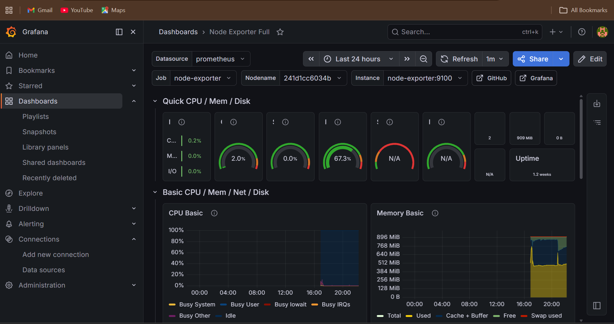
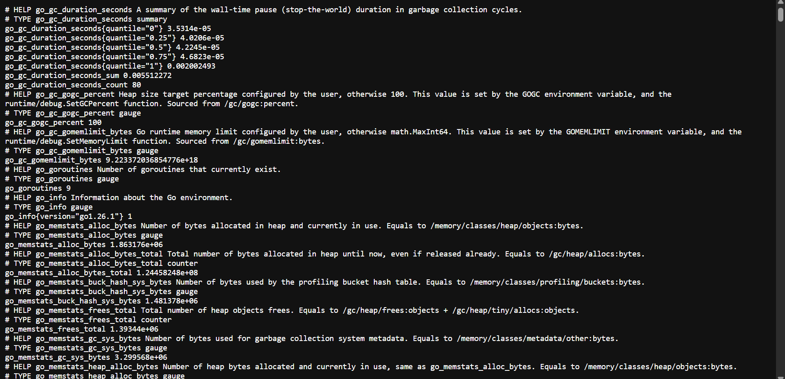

# 🍔 CraveCart — DevOps Enabled MERN Food Ordering Platform

CraveCart is a full-stack MERN-based food ordering platform designed with a production-style DevOps workflow.  
This project demonstrates containerization, CI/CD automation, Kubernetes orchestration, cloud deployment, and infrastructure monitoring using modern DevOps tools and practices.

---

# 🚀 Features

## 👤 Customer Features
- Browse food items
- Add items to cart
- Place orders securely
- JWT-based authentication
- Razorpay payment integration
- Responsive UI

## 🛠 Admin Features
- Manage food items
- Update order status
- Track customer orders
- Admin dashboard management

---

# 🧰 Tech Stack

## Frontend
- React.js
- Vite
- Axios
- CSS

## Backend
- Node.js
- Express.js
- MongoDB
- JWT Authentication

## DevOps & Cloud
- Docker
- Docker Compose
- Kubernetes
- GitHub Actions
- AWS EC2
- Docker Hub
- Linux
- Prometheus
- Grafana
- Node Exporter

---

# 🏗 System Architecture

```text
                    ┌────────────────────┐
                    │   GitHub Actions   │
                    │    CI/CD Pipeline  │
                    └─────────┬──────────┘
                              │
                              ▼
                    ┌────────────────────┐
                    │    Docker Hub      │
                    │ Container Registry │
                    └─────────┬──────────┘
                              │
                              ▼
 ┌─────────────────────────────────────────────────────┐
 │                    AWS EC2                         │
 │                                                     │
 │  ┌──────────┐   ┌──────────┐   ┌──────────────┐    │
 │  │Frontend  │   │ Backend  │   │   MongoDB    │    │
 │  │Container │   │Container │   │  Container   │    │
 │  └────┬─────┘   └────┬─────┘   └──────┬───────┘    │
 │       │              │                │             │
 │       └──────────────┴────────────────┘             │
 │                                                     │
 │   Monitoring Stack                                  │
 │   ┌──────────┐   ┌──────────┐   ┌──────────────┐    │
 │   │Prometheus│──▶│ Grafana  │◀──│Node Exporter │    │
 │   └──────────┘   └──────────┘   └──────────────┘    │
 └─────────────────────────────────────────────────────┘
```

---

# ⚙️ CI/CD Workflow

The project uses GitHub Actions for automating:

- Docker image build
- Docker Hub image publishing
- AWS EC2 deployment
- Automated container updates

## 🔄 Deployment Flow

```text
git push
   ↓
GitHub Actions Triggered
   ↓
Docker Image Build
   ↓
Push Images to Docker Hub
   ↓
SSH into AWS EC2
   ↓
Pull Latest Containers
   ↓
Restart Services
```

---

# 🐳 Docker Setup

## Clone Repository

```bash
git clone https://github.com/Akshat295/CraveCart.git
```

## Navigate to Project

```bash
cd CraveCart
```

## Build Containers

```bash
docker compose build
```

## Run Containers

```bash
docker compose up -d
```

## Stop Containers

```bash
docker compose down
```

---

# ☸️ Kubernetes Deployment

The application is deployed using Kubernetes for scalable and self-healing orchestration.

## Kubernetes Components Used

- Deployments
- Services
- Pods
- NodePort Services

## Apply Kubernetes Configurations

```bash
kubectl apply -f k8s/
```

## Verify Pods

```bash
kubectl get pods
```

## Verify Services

```bash
kubectl get services
```

---

# 📊 Monitoring & Observability

Monitoring stack implemented using:

- Prometheus
- Grafana
- Node Exporter

## Metrics Monitored

- CPU Usage
- Memory Usage
- Disk Usage
- Container Metrics
- System Health

---

# 📸 Grafana Monitoring Dashboards

## Infrastructure Monitoring Dashboard

### CPU / Memory Monitoring



---

### Node Exporter Metrics



---

# 🔐 Environment Variables

Create a `.env` file inside the backend directory.

```env
MONGO_DB_URL=your_mongodb_url
JWT_SECRET=your_secret
RAZORPAY_KEY=your_key
RAZORPAY_SECRET=your_secret
```

---

# 🚀 Deployment

The application is deployed on an Ubuntu-based AWS EC2 instance using Docker containers and automated GitHub Actions workflows.

---

# ✨ DevOps Highlights

- Containerized MERN application using Docker & Docker Compose
- Implemented CI/CD pipelines using GitHub Actions
- Automated Docker Hub publishing workflows
- Deployed applications on AWS EC2
- Configured Kubernetes Deployments & Services
- Built infrastructure monitoring dashboards using Prometheus & Grafana
- Implemented container orchestration and observability workflows

---

# 📚 Learning Outcomes

Through this project, I gained hands-on experience in:

- Containerization
- CI/CD Automation
- Cloud Deployment
- Kubernetes Orchestration
- Monitoring & Observability
- Linux-based Infrastructure
- DevOps Workflows

---

# 🔮 Future Improvements

- Nginx Reverse Proxy
- HTTPS SSL Setup
- Kubernetes Ingress
- Horizontal Pod Autoscaling
- Persistent Volumes
- Terraform Infrastructure Automation
- AWS EKS Deployment

---

# 👨‍💻 Author

## Akshat Johri

- GitHub: https://github.com/Akshat295
- LinkedIn: https://www.linkedin.com/in/akshat-johri-9724a625a/

---

# ⭐ Support

If you found this project useful, give it a ⭐ on GitHub!